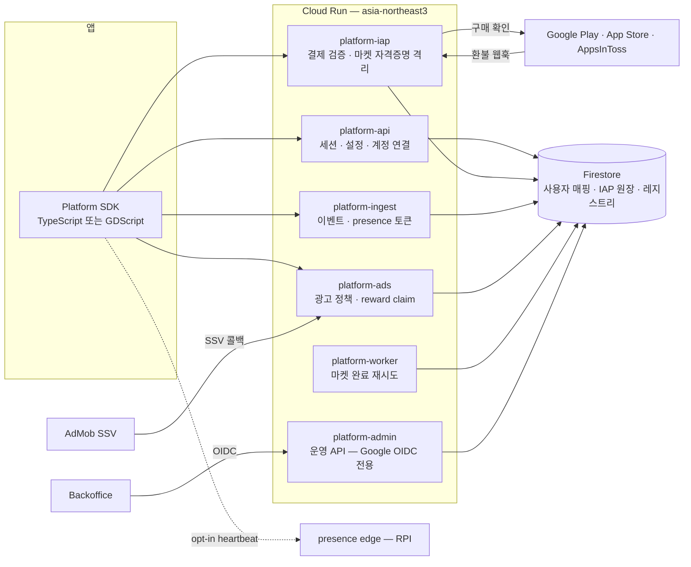

# seorilabs/platform

Seorilabs의 모든 앱·게임 밑에 깔리는 런타임 공통 백엔드와 클라이언트 SDK.

앱마다 따로 만들던 인증·결제 검증·이벤트 수집·원격 설정·보상형 광고 정산을
한 서버와 두 SDK로 모았다. 서버는 Go, SDK는 TypeScript(React Native·Web)와
GDScript(Godot)다.

**바로 시작하려면 → [Wiki: Getting Started](https://github.com/seorilabs/platform/wiki/Getting-Started)**

## 무엇을 제공하나

| 영역 | 내용 |
|---|---|
| **identity** | 앱별 Firebase Auth를 유지한 채 `(app_id, firebase_uid) → platform_user_id` 매핑. AppsInToss 로그인, 익명, Kakao·Apple 계정 연결 |
| **IAP** | Google Play / App Store / AppsInToss 3마켓 결제 검증과 entitlement 원장. 환불 웹훅 수신 |
| **events** | 저빈도 운영 이벤트 배치 수집. 파라미터 정규화 규약을 두 SDK가 동일하게 지킨다 |
| **config** | kill switch, 강제 업데이트, 점검 모드. 실패 시 열린 기본값 |
| **ads** | 보상형 광고 정책과 claim 상태 기계. AdMob SSV 검증 |
| **presence** | opt-in 최근 활성 세션 heartbeat. fail-open |
| **admin** | 백오피스 전용 운영 API. Google OIDC로만 접근 |

## 전체 그림



## 현재 상태

| 구성 요소 | 버전 / 상태 |
|---|---|
| 서버 | production. Cloud Run `asia-northeast3`, 6개 role(`api` `iap` `ingest` `ads` `admin` `worker`) |
| TypeScript SDK | `@seorilabs/platform-sdk` **0.4.0** |
| GDScript SDK | **0.6.7** — `v0.6.5`는 철회됐다 |
| 통합 릴리스 | [`v0.6.7`](https://github.com/seorilabs/platform/releases/tag/v0.6.7) — 두 SDK 산출물과 `platform-release.json` 매니페스트 |
| 등록 앱 | 13개 → [`registry/apps/`](registry/apps/README.md) |

API 계약은 `/v1` 하나이고 **영구히 깨지 않는다.** 마켓에 배포된 구버전 SDK가
2~3년 산다. 필드는 추가만 하고, 제거나 의미 변경은 `/v2`다.

새 `platform-release.json`은 source SHA, 두 SDK의 exact version·artifact digest,
OpenAPI/conformance revision, 변경 분류와 함께 영향 consumer 선택 계약을 서명 대상에
포함한다. consumer repo 목록은 release 뒤에도 바뀌므로 immutable asset에 복사하지 않고
`backoffice-active-apps` cohort를 `reconcile-time`에 exact repo ID로 확정하며, 하나라도
관측이 빠지면 전체 fan-out을 중단한다.
이미 발행된 `v0.6.7`에 선택 필드가 없던 경우만 같은 cohort로 읽으며, 다른 version의
누락은 계약 오류로 거부한다.

## 구조

```text
spec/           API 계약 SoT. openapi.yaml, 이벤트 사전, 두 SDK 공통 conformance 벡터
server/         Go. PLATFORM_ROLE 환경변수로 role을 고른다
packages/       TypeScript SDK (packages/sdk-ts)
sdk-gdscript/   Godot 4.3 addon. GitHub Release tarball로 배포한다
examples/       레퍼런스 배선 — React Native, Godot
registry/apps/  앱 레지스트리. git이 SoT이고 regsync가 Firestore로 올린다
scripts/        릴리스·검증 스크립트
deploy/         RPI edge 배포 매니페스트
docs/           자동화가 직접 검사하는 실행 계약만 둔다
```

## 문서

| 문서 | 위치 |
|---|---|
| 시작하기, SDK 가이드, 오류 코드, 앱 등록 | **[Wiki](https://github.com/seorilabs/platform/wiki)** |
| API 계약 (정본) | [`spec/openapi.yaml`](spec/openapi.yaml) |
| 이벤트 이름·파라미터 사전 | [`spec/events.md`](spec/events.md) |
| 두 SDK가 같이 통과해야 하는 행동 벡터 | [`spec/conformance/`](spec/conformance/README.md) |
| 앱 레지스트리 형식과 규칙 | [`registry/apps/README.md`](registry/apps/README.md) |
| GDScript SDK 상세 | [`sdk-gdscript/README.md`](sdk-gdscript/README.md) |
| Fleet 승인 게시 계약 | [`docs/platform-fleet-approval-publisher.md`](docs/platform-fleet-approval-publisher.md) |

설계 결정 기록(ADR), 운영 런북, 작업 로그는 비공개 원장에 있다. 이 저장소에는
코드와 자동화가 검사하는 계약만 남긴다.

## 아키텍처 규칙

- **R1** 백오피스는 런타임 경로에 없다. 백오피스가 죽어도 결제·검증은 정상 동작한다.
- **R2** 백오피스 DB는 런타임 유저 데이터를 0바이트도 저장하지 않는다. 플랫폼 Firestore가 SoT.
- **R3** `platform-iap`은 별도 서비스다. 마켓 자격증명은 이 서비스에만 마운트한다.
- **R4** `/v1`은 영구히 깨지 않는다.
- **R5** IAP 원장 불변식 12개는 언어와 무관하게 보존한다. 코드 주석이 불변식 번호를 인용한다.
- **R6** 플랫폼에 PII를 저장하지 않는다. 이메일·이름·전화번호는 각 앱의 Firebase Auth에만 둔다.

## 개발

| 도구 | 버전 |
|---|---|
| Go | 1.25 |
| Node | 20 이상 (CI는 24) |
| pnpm | 11.3 |
| Godot | 4.3 (GDScript SDK 검증) |

```bash
# 서버
cd server
go vet ./... && go test ./...
go run ./cmd/regsync --dir=../registry/apps --dry-run   # 레지스트리 검증

# SDK와 릴리스 스크립트
pnpm install --frozen-lockfile
pnpm test && pnpm typecheck && pnpm build

# 계약 대조
bash scripts/check_spec_routes.sh        # openapi.yaml ↔ Go 라우트
bash scripts/check_deploy_workflow.sh    # 배포 경계
bash scripts/sdk_gdscript_checksum.sh --check
```

Firestore 에뮬레이터가 필요한 통합 테스트는 `-tags=integration`으로 분리돼 있어
기본 게이트에 포함되지 않는다.

## 기여

- 변경은 PR로만 들어간다. `main` 직접 push와 force push는 ruleset이 막는다.
- 외부 기여자의 PR은 메인테이너가 워크플로 실행을 승인해야 CI가 돈다.
- 리뷰 thread를 전부 resolve해야 병합할 수 있다. squash merge만 허용한다.
- `spec/openapi.yaml`이 계약의 정본이다. Go·TS 타입은 산출물이므로 계약을 바꿀 때는
  스펙을 먼저 고친다. `scripts/check_spec_routes.sh`가 어긋남을 잡는다.
- 두 SDK의 행동을 바꾸는 변경은 `spec/conformance/*.json`에 벡터를 먼저 추가하고
  양쪽이 실패하는 것을 확인한 뒤 고친다.
- `main` 병합은 곧 production 배포 파이프라인 시작이다. 실제 배포는 environment
  승인에서 한 번 멈춘다.

## 라이선스

[MIT](LICENSE). 저작권은 Seorilabs에 있다.
