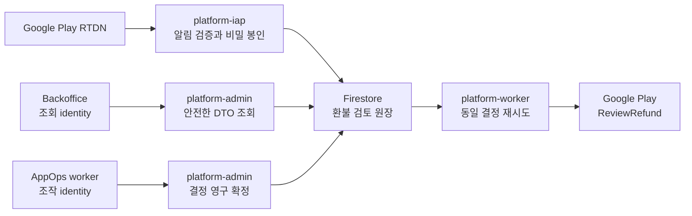

# ADR 0014 — Google Play 환불 검토 결정은 외부 호출 전에 영구 확정한다

## 상태

채택. 2026-08-05.

## 맥락

Google Play는 chargeback 등 환불 검토가 필요한 주문에
`pendingRefundReviewNotification`을 보내고, 개발자가 24시간 안에
[`orders.reviewrefund`](https://developers.google.com/android-publisher/api-ref/rest/v3/orders/reviewrefund)로
의견을 제출할 수 있게 한다. Google은 첫 API 호출의 의견만 기록하고 같은 주문에 대한
후속 호출은 성공으로 응답하더라도 무시한다. 따라서 HTTP 타임아웃이나 worker 재시도가
서로 다른 의견을 보내면, 플랫폼 원장과 Google의 실제 판단이 영구히 어긋날 수 있다.

알림에는 API 호출에 필요한 `pendingRefundToken`과 `orderId`가 들어 있다. 이 값은
브라우저, 백오피스 DB, 로그에 노출해서는 안 된다. 반대로 `platform-admin`에는 마켓
자격증명을 주지 않고, 백오피스의 조회 identity와 조작 identity도 분리해야 한다는
ADR 0011의 경계는 유지해야 한다.

Google의 선택적 사용 증거에는 자유 서술, IP 주소, 위치가 포함될 수 있다. 플랫폼은
PII를 저장하지 않는다는 ADR 0005를 지켜야 하고, 현재 신뢰할 수 있는 공통 소비량
원장도 없다.

## 결정

### 전체 흐름



`platform-iap`은 RTDN을 수신하고, `platform-admin`은 운영자 결정을 원장에 확정하며,
마켓 자격증명을 가진 `platform-worker`만 Google API를 호출한다. Backoffice와
`platform-admin`에는 Google 자격증명이나 복호화 키를 주지 않는다.

### 앱 식별과 활성화 조건

- `registry/apps/*.json`의 IAP 설정에 Google Play package name을 명시한다. 레지스트리가
  package name에서 `appId`로 가는 유일한 원장이다.
- IAP가 활성화되고 `markets`에 Google Play가 포함된 앱의 package name은 비어 있거나
  중복될 수 없다.
- RTDN의 package name이 레지스트리에 없으면 임의의 앱으로 귀속하지 않는다. 설정 오류로
  fail-closed하고 Pub/Sub 재시도와 운영 health에 남긴다.
- 실제 package name은 구현 시 저장소와 배포 설정에서 확인한다. 추측한 값으로 활성화하지 않는다.

### 환불 검토 원장

환경 prefix 아래 `pending_refund_reviews/{reviewId}`를 영구 보존한다.

```text
reviewId = sha256(pendingRefundToken)
```

원장은 다음 정보를 가진다.

- 식별·대조: `reviewId`, `appId`, `packageName`, `orderIdSha256`, `environment`
- 알림: 숫자 원문을 보존하는 `refundReason`, `receivedAt`, `dueAt`
- 상태: `pending`, `decided`, `responded`, `expired`, `failed`
- 결정: `requestId`, `refundPreference`, `sampleContentProvided`, 고정 `reason`,
  `actor`, `decidedAt`
- 전달: `attemptCount`, `nextAttemptAt`, `leaseId`, `claimExpiresAt`, `respondedAt`,
  `lastErrorCode`
- 비밀 봉투: `keyId`, `nonce`, `ciphertext`

`dueAt`은 최초 알림 수신 시각으로부터 24시간이다. 같은 token의 재전송은 앱, package,
order hash, reason이 모두 일치할 때만 멱등 처리하고 최초 `receivedAt`과 `dueAt`을
바꾸지 않는다. 충돌하면 `refund_review_replay_mismatch`로 fail-closed한다.

`orderId`와 `pendingRefundToken`은 하나의 비밀 payload로 AES-256-GCM 암호화한다.
키는 Secret Manager에서 주입하는 버전형 keyring으로 관리한다. 첫 키로 암호화하고
나머지 키는 회전 중 복호화에만 사용한다. AAD에는 `reviewId`, `appId`, `packageName`,
`orderIdSha256`, `environment`를 결합해 다른 문서로 ciphertext를 옮겨 쓸 수 없게 한다.
이 키는 `platform-iap`과 `platform-worker`에만 주입하고 기존 계정참조 HMAC 키와
재사용하지 않는다.

RTDN의 `obfuscatedAccountId`와 `obfuscatedProfileId`는 queue 처리와 Google 응답에
필요하지 않으므로 저장하거나 Admin API로 전달하지 않는다.

`responded`, `expired`, `failed`가 되면 ciphertext, nonce를 지우되 문서와 결정·전달
감사 필드는 삭제하지 않는다. `pending`이나 `decided` 상태에서 복호화가 일시 실패하면
deadline 전까지 재시도할 수 있도록 봉투를 보존한다.

### 운영자 결정과 멱등성

OpenAPI 원장을 먼저 수정해 다음 additive Admin 계약을 추가한다.

- `GET /v1/admin/apps/{appId}/iap/refund-reviews`
- `POST /v1/admin/apps/{appId}/iap/refund-reviews/{reviewId}/decision`

목록 응답에는 review ID, 앱, 환경, 상태, reason, deadline, 결정과 전달 시각만 포함한다.
order ID, token, ciphertext, PUID, 마켓 계정 참조는 응답하지 않는다.

결정 요청은 다음 값만 허용한다.

- UUID `requestId`
- `expectedEnvironment`
- `refundPreference`: `DECLINE`, `APPROVE`, `NEUTRAL`
- 명시적으로 선택한 `sampleContentProvided`: `true` 또는 `false`
- 고정 감사 reason: `verified_fulfillment`, `customer_refund_supported`,
  `insufficient_evidence`, `internal_validation`
- 서버가 계산한 `RESPOND REFUND {appId} {reviewId} {refundPreference}` typed confirmation

기본 선택값을 두지 않는다. `sampleContentProvided`를 앱 종류나 상품에서 추론하지 않고,
운영자가 evidence를 확인한 뒤 명시적으로 확정한다.

`refund_review_decisions/{requestId}`에 전체 비밀을 제외한 고정 command를 create-only로
보존하고, 같은 Firestore 트랜잭션에서 대상 review를 `pending`에서 `decided`로 바꾼다.
이 commit이 Google에 제출할 의견의 선형화 지점이다.

- 같은 `requestId`와 정확히 같은 command는 저장된 결과를 멱등 반환한다.
- 같은 `requestId`의 다른 command나 다른 운영 조작은
  `operator_replay_mismatch`로 거부한다.
- 이미 결정된 review에 다른 `requestId` 또는 다른 의견을 제출하면
  `refund_review_already_decided`로 거부한다.
- exact retry는 현재 앱 pause, rate gate 같은 mutable precondition보다 먼저 영구
  결정에서 복구한다. 신규 결정은 ADR 0011의 write allowlist, 앱 binding, 환경,
  typed confirmation, actor, durable rate limit을 모두 검증한다.

### Google 제출 worker

`platform-worker`는 `decided` review를 lease로 한 건씩 claim한다. 비밀 봉투를 복호화하고
영구 결정에서 `OrdersReviewRefundRequest`를 구성한 뒤 Google에 제출한다.

- 요청에는 필수 값인 pending token, `refundPreference`, `sampleContentProvided`만 넣는다.
- `consumptionPercentageMilliunits`와 `consumptionUsageEvents`는 보내지 않는다. 공통 원장에
  신뢰 가능한 소비량 증거가 없고 선택 필드가 PII를 포함할 수 있기 때문이다.
- 타임아웃과 재시도는 저장된 동일 body만 전송한다. 운영자가 결정 내용을 수정하거나
  새 request ID로 재응답할 수 없다.
- 일시 오류는 deadline 전까지 짧은 backoff로 재시도한다. deadline이 지나면 API를 새로
  호출하지 않고 `expired`로 종결한다.
- 성공은 `responded`, 비재시도 가능한 API 거부는 `failed`로 종결한다. 응답 body나
  원문 token은 로그에 남기지 않는다.

Admin health에는 `pendingRefundReviewCount`, `dueSoonRefundReviewCount`,
`failedRefundReviewCount`를 additive 필드로 노출한다. `dueSoon`은 deadline이 1시간 안인
미응답 review다.

### Backoffice 경계

- `/platform/iap`의 기존 콘솔에 환불 검토 queue를 추가한다. 새 commerce 원장을 만들지 않는다.
- 브라우저 조회는 기존 read identity로 Admin API를 실시간 호출하고 MySQL에 snapshot을
  복제하지 않는다.
- 결정은 기존 `AppOperationRun`과 AppOps worker의 write identity를 거친다.
- command envelope에는 app ID, review ID, 예상 환경, preference, sample content 여부,
  고정 reason, typed confirmation만 한시 저장한다. order ID, token, ciphertext, PUID,
  자유 서술은 저장하지 않는다.
- worker는 실행 직전에 운영자 권한, 앱과 slug binding, command TTL, request ID와 payload를
  다시 검증하고 Admin 응답의 target echo까지 일치할 때만 성공으로 확정한다.

### 배포와 검증

1. registry 스키마와 앱 package name을 먼저 배포하고 중복·누락 검증을 통과시킨다.
2. Secret Manager에 별도 AES-256-GCM keyring을 만들고 `platform-iap`과
   `platform-worker`에만 읽기 권한을 준다.
3. Firestore 인덱스, RTDN parser와 queue write를 배포하되 Admin 결정 UI는 아직 닫아 둔다.
4. Admin read·decision API와 worker를 배포하고 role별 secret/IAM 부재를 readback한다.
5. Backoffice read UI와 AppOps decision을 연다.
6. Google Play license tester의 chargeback test instrument로 RTDN 수신, 24시간 deadline,
   단일 결정, 실제 ReviewRefund 성공을 end-to-end 확인한다.

코드·배포 성공과 license tester E2E는 서로 다른 완료 상태로 보고한다. production 자동
판단이나 공개 릴리스는 이 ADR의 범위가 아니다.

## 결과

- 네트워크가 불확실해도 Google에 서로 다른 의견을 제출하지 않는다.
- 마켓 자격증명과 암호화 키가 Backoffice 또는 Admin role로 확산되지 않는다.
- 브라우저와 백오피스 DB에 order ID, pending token, 사용자 식별 정보가 남지 않는다.
- 환불 의견은 자동 정책이 아니라 운영자의 명시적 판단으로만 확정된다.
- 검토 원장과 결정 감사는 영구 보존하면서 외부 호출용 비밀은 terminal 상태에서 제거한다.
- 24시간 운영 SLA와 실패가 health에 드러나므로 queue를 방치하기 어렵다.

## 검토한 대안

- **Backoffice가 Google API를 직접 호출**: 마켓 자격증명과 비밀 token이 브라우저 또는
  백오피스 경계로 이동하므로 배제한다.
- **Admin 요청 중 Google API를 동기 호출**: commit과 외부 호출 사이 장애에서 결과를
  확정할 수 없고 HTTP timeout이 운영자 재결정을 유도하므로 배제한다.
- **자동으로 APPROVE 또는 DECLINE**: 제품별 이행 증거와 정책이 없고 현재 운영 원칙인
  수동 검토를 바꾸므로 배제한다.
- **Cloud KMS로 건별 암복호화**: 강한 중앙 키 경계가 있지만 webhook과 worker의 외부 의존,
  latency, IAM 운영 범위가 커진다. 기존 Secret Manager 주입 경계로 충분한 초기 버전에서는
  버전형 AES-GCM keyring을 사용하고, KMS 전환은 별도 ADR로 다룬다.
- **사용량과 위치 등 선택 증거 전송**: 신뢰 가능한 공통 소비량 원장이 없고 PII 금지와
  충돌할 수 있으므로 초기 범위에서 배제한다.

## 근거

- [Google Play RTDN reference](https://developer.android.com/google/play/billing/rtdn-reference)
- [Provide refund and chargeback suggestions](https://developer.android.com/google/play/billing/provide-refund-and-chargeback-suggestions)
- [Google Play Android Publisher ReviewRefund API](https://developers.google.com/android-publisher/api-ref/rest/v3/orders/reviewrefund)
- [Google Play Billing test instruments](https://developer.android.com/google/play/billing/test)
