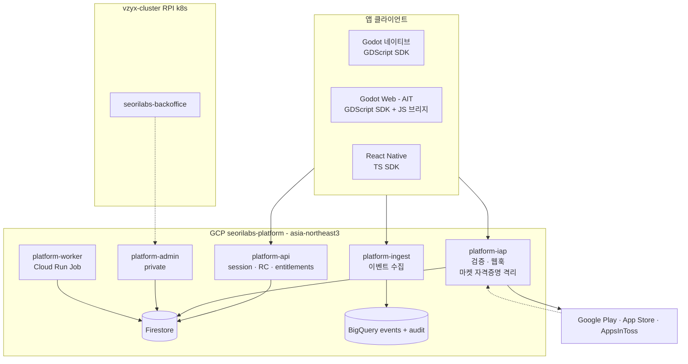

# Overview

## 배치도

백오피스에서 플랫폼으로 가는 점선은 **Google OIDC ID token 기반 egress 전용** 호출이다. 마켓에서 오는 점선은 RTDN과 App Store Server Notification 웹훅.

## 서비스 배포 단위

단일 이미지 · 단일 코드베이스. `PLATFORM_ROLE`로 스위치한다.

| role | 노출 | 특징 |
|---|---|---|
| `api` | public | session, RemoteConfig, entitlement 조회 |
| `iap` | public | 검증, 웹훅. **마켓 자격증명은 여기에만** |
| `ingest` | public | 이벤트 수집. 고QPS, I/O 바운드 write-only |
| `admin` | **private** | `--no-allow-unauthenticated` |
| `worker` | Job | 완료 outbox 재시도 |

`admin`을 private으로 두면 **Cloud Run 인프라가 애플리케이션 코드 진입 전에 거부**하므로, 라우팅 버그로 admin 핸들러가 노출되는 사고가 구조적으로 불가능하다.

## 저장소 선택

### Firestore, 단 Firebase 미등록

Firestore는 GCP 제품이고 `firestore.googleapis.com`만 켠다. **Firebase 프로젝트를 등록하지 않는다.** 클라이언트가 Firestore에 직접 붙지 않고 REST API만 호출하므로 Firebase 앱 등록이 필요 없다. → ADR 0002

| 워크로드 | 저장소 | 근거 |
|---|---|---|
| identity 매핑 | Firestore, 문서 ID = `{app_id}__{uid}` | 쿼리가 아닌 **직접 읽기 1회**. 인덱스 불필요 |
| RemoteConfig | Firestore + 인메모리 캐시 + ETag | 앱당 문서 소수. 읽기 캐시가 압도적 |
| **IAP 원장** | Firestore 트랜잭션 | lizard-tycoon이 이미 1,421줄 repository로 운영 중 |
| 이벤트 | **BigQuery만** | Firestore write가 최대 비용 항목. **이벤트를 Firestore에 절대 넣지 않는다** |

### Cloud SQL을 배제한 이유

트래픽 0에도 **월 10~25달러 고정비**가 붙는다. `min-instances=0` 전제와 정면 충돌한다. Firestore는 일 5만 read / 2만 write 무료라 현재 규모에서 사실상 0원이다.

대가로 **ORM과 SQL을 못 쓴다.** repository 포트로 격리해 나중 전환 여지를 남긴다. → ADR 0003

### BigQuery `platform.audit` — Firestore 제약의 구조적 대응

Firestore는 분석 DB가 아니다. 조인 불가, `LIKE` 불가, 집계는 `count` 수준, 복합 쿼리는 사전 인덱스 필수.

> **모든 쓰기 작업을 `platform.audit`에 한 줄씩 append 한다.**

결제는 정산·감사 쿼리가 필수라 이게 특히 중요하다.

| | Firestore | BigQuery |
|---|---|---|
| 역할 | **런타임 조회 경로** | **운영·분석 조회 경로** |
| 답하는 질문 | "이 유저의 entitlement는?" | "지난주 결제 성공률은?" |

## 리전

`asia-northeast3` 고정. Firestore와 BigQuery 모두. **생성 후 변경 불가**이므로 되돌릴 수 없다. → ADR 0004

## 환경 분리

프로젝트를 추가하지 않고 같은 프로젝트 안에서 나눈다.

| | staging | production |
|---|---|---|
| Cloud Run | `platform-*-stg` | `platform-*` |
| Firestore | **`(default)` + 컬렉션 prefix `stg_`** | `(default)` |
| BigQuery | `platform_stg` | `platform` |

**named database로 나누지 않는 이유**: Firestore 무료 할당량이 `(default)` 데이터베이스에만 적용된다. named DB는 첫 읽기부터 과금된다.

트레이드오프는 물리적으로 같은 DB라는 점이다. staging 트래픽이 사람 1명 수준이고 위험 작업은 dry-run과 하드 상한으로 막혀 있어 수용한다. 규모가 커지면 `seorilabs-platform-stg` 프로젝트로 분리한다.

CI와 로컬은 **Firestore 에뮬레이터**를 쓴다.

## 콜드스타트

Go 콜드스타트가 100~300ms라 Node 대비 5~10배 빠르다. Node 콜드스타트의 대부분은 GCP SDK가 런타임에 gRPC와 protobuf를 파싱하는 비용인데, **Go는 컴파일 타임에 링크되어 이 비용이 0**이다.

| 경로 | 체감 | 판단 |
|---|---|---|
| 이벤트 수집 | 없음 — fire-and-forget | 무관 |
| session, RemoteConfig | 스플래시 중 백그라운드 | 허용 |
| **IAP 검증** | **결제 직후. 유저가 대기** | **유일한 실제 문제** |
| 웹훅 | 마켓이 재시도함 | 무관 |

대응: **Startup CPU boost 켬** · `min-instances=0` 유지 · warm-up ping은 P0 실측 후 결정 · 부팅 시 세션 호출을 즉시 발사해 **유저 트래픽 자체를 warm-up으로** 만든다.

클라이언트는 구매 버튼에 즉시 로딩 인디케이터를 띄우고, Godot `HTTPRequest` 타임아웃을 15초로 둔다. Apple 검증은 외부 API 왕복이 붙는다.

> 참고: 기존 Cloud Functions IAP 검증도 같은 콜드스타트를 갖고 있다. **플랫폼 전환이 오히려 개선일 가능성이 높다.**
