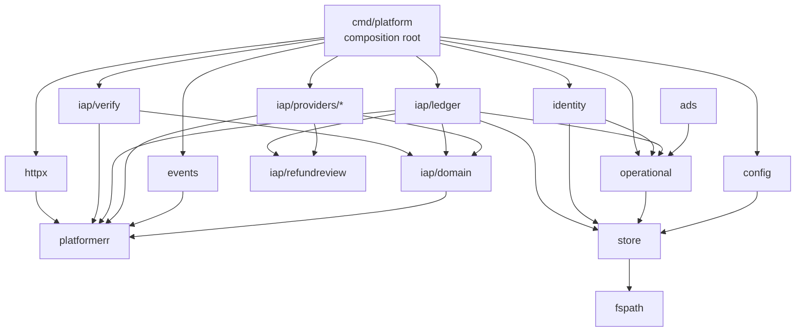

# 서버 패키지 구조

Go 서버의 패키지 배치와 의존성 규칙. **코드를 쓰기 전에 합의한 설계다.**

## 결정 요약

| 쟁점 | 결정 |
|---|---|
| 인터페이스 배치 | **절충** — 값 타입은 `domain`, 인터페이스는 **소비자 쪽** |
| 에러 모델 | **`PlatformError`가 code + HTTP status를 들고 다닌다** |
| Firestore 접근 | **`store`가 경로 생성을 독점**하고 repository는 도메인별 |
| role 스위치 | role별 `newXxxServer()` + `main.go`는 스위치만 |

## 패키지 트리

```text
server/
├── cmd/
│   ├── platform/          composition root. PLATFORM_ROLE 스위치
│   └── fs/                Firestore 조회 CLI
└── internal/
    ├── fspath/            경로 파싱과 환경 prefix. 표준 라이브러리만
    ├── platformerr/       PlatformError. code + status
    ├── store/             ★ Firestore 접근 독점. 경로 생성을 통제
    ├── httpx/             envelope, 미들웨어, 에러 → HTTP 매핑
    ├── registry/          앱 레지스트리 + 캐시
    ├── identity/          토큰 검증, platform_user
    ├── config/            RemoteConfig
    ├── events/            이벤트 수집 → BigQuery
    ├── operational/       확정 운영 이벤트 outbox + 서명 전달
    ├── ads/               앱별 광고 정책, claim, SSV 검증과 상태
    └── iap/
        ├── domain/        ★ 값 타입과 불변식 상수만. 인터페이스 없음
        ├── verify/        유스케이스. ★ 여기서 인터페이스를 정의한다
        ├── ledger/        Firestore 원장 구현
        ├── catalog/       SKU 카탈로그
        ├── binding/       HMAC 계정참조
        ├── refundreview/  AES-GCM 봉투와 Google 제출 값
        ├── providers/
        │   ├── play/  apple/  toss/
        ├── webhook/       ASSN v2, RTDN 수신
        └── worker/        완료 outbox + 환불 검토 결정 재시도
```

## 의존성 방향



**규칙 4가지.**

1. **`iap/domain`은 표준 라이브러리와 `platformerr` 외에 아무것도 import하지 않는다.** Firestore·HTTP·마켓 SDK를 모른다
2. **`iap/verify`가 인터페이스를 정의하고 `ledger`·`providers`가 구현한다.** 구현 패키지는 `verify`를 import하지 않는다
3. **`store` 밖에서 Firestore 클라이언트를 만들지 않는다**
4. `cmd/platform`만 모든 것을 조립한다. 패키지 간 직접 조립 금지
5. `ads`는 앱 레지스트리를 경계로 사용하고, callback path의 앱과 claim의
   앱·사용자·광고 unit·reward가 모두 일치할 때만 `server_verified`로 전이한다
6. `operational`은 Discord를 직접 알지 않는다. 도메인 transaction에는 PII 없는
   event만 쓰고 Backoffice가 공급자·채널·표현을 결정한다

## 인터페이스 배치 — 절충안

값 타입은 `domain`에 모아 원본 `domain.ts`와 대조 가능하게 두고, **인터페이스는 호출하는 쪽에 둔다.**

```go
// internal/iap/domain/purchase.go — 값 타입만
package domain

type Platform string

const (
    PlatformGooglePlay Platform = "google_play"
    PlatformAppStore   Platform = "app_store"
    PlatformAppsInToss Platform = "apps_in_toss"
)

type State string

const (
    StateActive  State = "active"
    StatePending State = "pending"
    StateRevoked State = "revoked"
    StateInvalid State = "invalid"
)

// StateRank는 불변식 3의 stale 억제에 쓴다.
// revoked > active > pending. 늦게 끝난 grant가 환불을 되돌리지 못하게 한다.
func (s State) Rank() int

type VerifiedPurchase struct {
    Platform          Platform
    ProductID         string
    CanonicalID       string // Play: purchaseToken / Apple: originalTransactionId / AIT: orderId
    ProviderOrderID   string
    PlatformAccountID string // 원문. 저장할 때 sha256으로 바꾼다
    PurchasedAt       time.Time
    ObservedAt        time.Time
    State             State
    Completion        Completion
}

// OrderKey는 불변식 1이다. sha256("{platform}:{canonicalId}")
func OrderKey(p Platform, canonicalID string) string
```

```go
// internal/iap/verify/service.go — 소비자가 인터페이스를 정의한다
package verify

type Verifier interface {
    Platform() domain.Platform
    Verify(ctx context.Context, proof domain.Proof) (domain.VerifiedPurchase, error)
    CompleteGrant(ctx context.Context, p domain.VerifiedPurchase) error
}

type Ledger interface {
    Grant(ctx context.Context, in domain.GrantInput) (domain.GrantResult, error)
    RecordPending(ctx context.Context, in domain.GrantInput) error
    RevokeByPurchase(ctx context.Context, in domain.RevokeInput) error
    ListActive(ctx context.Context, puid string) ([]string, error)
}

type Service struct {
    verifiers map[domain.Platform]Verifier
    ledger    Ledger
    catalog   Catalog
}
```

`providers/apple`은 **`verify` 패키지를 import하지 않는다.** 메서드 시그니처만 맞으면 Go가 암묵적으로 만족시킨다. 이 덕분에 테스트에서 fake를 꽂기도 쉽다.

> 원본이 `dependencies` 주입으로 fake verifier를 넣던 패턴이 Go에서는 **인터페이스 만족만으로** 된다. `providers.unit.test.ts` 744줄의 테스트 전략을 그대로 옮길 수 있다.

## 에러 모델 — `PlatformError`

원본 `IapError(code, message, httpStatus)`와 같은 모양이다. 에러 코드가 60개 넘고 각각 HTTP 상태가 정해져 있어, **선언을 한 곳에 모으는 편이 누락을 잡기 쉽다.**

```go
// internal/platformerr/error.go
package platformerr

type Code string

const (
    CodePurchaseOwnedByAnotherUser Code = "purchase_owned_by_another_user"
    CodePurchaseNotFound           Code = "purchase_not_found"
    CodeProductTypeMismatch        Code = "product_type_mismatch"
    // ... 60여 개
)

// statusByCode가 코드와 HTTP 상태의 단일 대응표다.
// 새 코드를 추가하면 여기 등록해야 하고, 빠뜨리면 statusOf가 500을 준다.
var statusByCode = map[Code]int{
    CodePurchaseOwnedByAnotherUser: http.StatusConflict,
    CodePurchaseNotFound:           http.StatusUnprocessableEntity,
    CodeProductTypeMismatch:        http.StatusUnprocessableEntity,
}

type Error struct {
    Code    Code
    Message string // 한국어. 클라이언트가 이 문자열로 분기하지 않는다
    Status  int
    err     error // 원인
}

func (e *Error) Error() string { ... }
func (e *Error) Unwrap() error { return e.err }

func New(code Code, msg string) *Error
func Wrap(err error, code Code, msg string) *Error

// CodeOf는 에러 체인에서 코드를 뽑는다. PlatformError가 아니면 CodeInternal.
// 호출자는 errors.Is 대신 이걸 쓴다. 코드 비교가 의도이기 때문이다.
func CodeOf(err error) Code
```

판정은 이렇게 한다.

```go
if platformerr.CodeOf(err) == platformerr.CodePurchaseNotFound {
    // 재시도 가능
}
```

`httpx`는 `*Error`를 꺼내 그대로 envelope으로 만든다.

```go
// internal/httpx/respond.go
func WriteError(w http.ResponseWriter, err error) {
    var pe *platformerr.Error
    if !errors.As(err, &pe) {
        pe = platformerr.New(platformerr.CodeInternal, "처리 중 문제가 생겼어요")
    }
    w.Header().Set("Cache-Control", "no-store") // 불변식 12
    w.WriteHeader(pe.Status)
    json.NewEncoder(w).Encode(envelope{OK: false, Error: &errBody{pe.Code, pe.Message}})
}
```

**트레이드오프**: 도메인이 HTTP를 안다는 점이 순수하지 않다. 대신 60개 대응을 한 파일에서 보고, 매핑 누락이 조용히 500으로 새는 걸 막는다. 원본과 같은 모양이라 이식 중 대조도 쉽다.

## store — 경로 생성 독점

**환경 prefix를 빠뜨리면 staging이 production 데이터를 건드린다.** 이걸 규율이 아니라 타입으로 막는다.

```go
// internal/store/store.go
package store

type Client struct {
    fs     *firestore.Client // ★ export하지 않는다
    prefix string            // "" (production) 또는 "stg_"
}

func New(ctx context.Context, projectID, prefix string) (*Client, error)
func (c *Client) Close() error

// Doc과 Collection이 fspath.Path만 받는다.
// 문자열을 직접 넘길 수 없으므로 prefix 적용을 우회할 방법이 없다.
func (c *Client) Doc(p fspath.Path) (*firestore.DocumentRef, error)
func (c *Client) Collection(p fspath.Path) (*firestore.CollectionRef, error)
func (c *Client) RunTransaction(ctx context.Context, fn func(context.Context, *Tx) error) error
```

내부에서 이렇게 동작한다.

```go
func (c *Client) Doc(p fspath.Path) (*firestore.DocumentRef, error) {
    if p.Kind() != fspath.KindDocument {
        return nil, platformerr.New(platformerr.CodeInternal, "문서 경로가 아니에요")
    }
    prefixed, err := p.WithEnvPrefix(c.prefix)
    if err != nil {
        return nil, err
    }
    return c.fs.Doc(prefixed.String()), nil
}
```

**`fs` 필드를 export하지 않는 것이 핵심이다.** 다른 패키지가 Firestore 클라이언트를 꺼내 쓸 수 없다.

repository는 도메인별로 `store.Client`를 받아 자기 관심사만 다룬다.

```go
// internal/iap/ledger/ledger.go
type Ledger struct {
    store *store.Client
}

func New(s *store.Client) *Ledger

func (l *Ledger) Grant(ctx context.Context, in domain.GrantInput) (domain.GrantResult, error) {
    // store.RunTransaction 안에서 order + internal + projection 3문서를 원자 갱신
}
```

## role 스위치

```go
// cmd/platform/main.go
switch role {
case RoleAPI:
    srv, err = newAPIServer(ctx, cfg)
case RoleIAP:
    srv, err = newIAPServer(ctx, cfg)
case RoleIngest:
    srv, err = newIngestServer(ctx, cfg)
case RoleAdmin:
    srv, err = newAdminServer(ctx, cfg)
case RoleWorker:
    return runWorker(ctx, cfg) // HTTP 서버가 아니다
}
```

`newXxxServer`는 각각 `server_api.go`처럼 파일을 나눈다. **role별로 무엇을 조립하는지가 한눈에 보여야** IAM 격리(R3)가 코드와 일치하는지 검토할 수 있다.

`newIAPServer`만 마켓 자격증명을 읽는다. 다른 role에서 그 코드가 실행되지 않는다.

## 테스트 전략

| 대상 | 방식 | 게이트 |
|---|---|---|
| `fspath`, `platformerr`, `catalog`, `binding` | 순수 단위. 테이블 드리븐 | **기본** |
| `verify` 유스케이스 | fake Verifier·Ledger 주입 | **기본** |
| `providers/*` | fake HTTP 서버 (`httptest`) | **기본** |
| `ledger` 원장 | **Firestore 에뮬레이터** | 별도 태그 |
| 웹훅 서명 | 골든 벡터 | **기본** |

에뮬레이터 테스트는 `//go:build emulator` 태그로 분리한다. ARC 러너에 Java가 있는지 미확인이라 기본 게이트에 넣지 않는다.

```bash
go test ./...                    # 기본
go test -tags=emulator ./...     # 에뮬레이터 필요
```

## 단계별로 추가되는 패키지

| 단계 | 추가 |
|---|---|
| P0 | `fspath`, `cmd/fs` |
| P1 | `platformerr`, `store`, `httpx`, `registry`, `identity` |
| P2 | `events` |
| P3 | `config` |
| P4 | `iap/domain`, `iap/ledger`, `iap/catalog`, `iap/binding`, `iap/verify` |
| P5 | `iap/providers/{play,apple,toss}` |
| P6 | `iap/webhook`, `iap/worker` |

**P1에서 `platformerr`와 `store`를 먼저 세운다.** 이후 모든 패키지가 이 둘 위에 올라간다.
