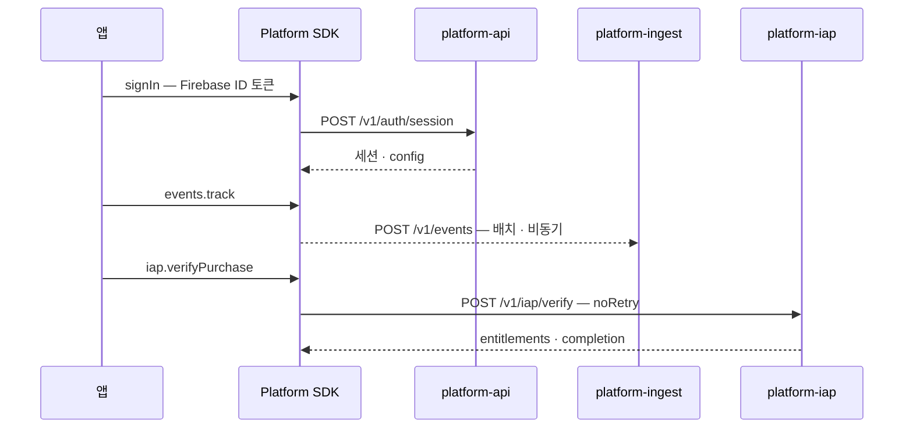

# React Native 레퍼런스 — 플랫폼 SDK 붙이기

RN 앱이 플랫폼을 쓰는 최소 형태. 전체 가이드는
[Wiki: TypeScript SDK](https://github.com/seorilabs/platform/wiki/TypeScript-SDK)를 본다.

## 전체 흐름



## 1. 설치

GitHub Release의 tarball을 직접 설치한다. 인증이 필요 없다.

```bash
pnpm add https://github.com/seorilabs/platform/releases/download/v0.6.7/seorilabs-platform-sdk-0.4.0.tgz
```

npm 공개 레지스트리(`@seorilabs/platform-sdk`)로 받을 수도 있다. 공개 패키지라
`.npmrc` 레지스트리 설정이나 토큰 없이 `pnpm add @seorilabs/platform-sdk`로 설치된다.
과거 GitHub Packages 게시본(0.4.0 이하)을 쓰는 lockfile은 그대로 동작한다.

Node 20 이상, `fetch` 전역이 필요하다. RN은 내장한다.

## 2. 조립

```ts
import { createPlatform } from "@seorilabs/platform-sdk";

export const platform = createPlatform({
  baseUrl: "https://platform-api-306278488979.asia-northeast3.run.app",
  iapBaseUrl: "https://platform-iap-306278488979.asia-northeast3.run.app",
  ingestBaseUrl: "https://platform-ingest-306278488979.asia-northeast3.run.app",
  adsBaseUrl: "https://platform-ads-306278488979.asia-northeast3.run.app",
  appId: "my-app",
  eventAllowlist: ["seori_session_start", "onboarding_complete"],
  // 실제 앱은 react-native-device-info 등으로 채운다. 함수를 넘기면 flush
  // 시점에 평가되므로 앱 안에서 언어가 바뀌어도 다음 배치부터 반영된다.
  eventContext: {
    platform: "android",
    appVersion: "1.0.0",
    locale: "ko-KR",
  },
  sessionStore: new AsyncStorageSessionStore(),
  presenceEnabled: false,
});

platform.start();  // 이벤트 자동 전송 시작
```

URL은 Secret이 아니다. 역할별 URL을 생략하면 `baseUrl`로 간다. `appId`는
[`registry/apps/`](../../registry/apps/README.md)에 등록된 값이어야 한다.

### 세션 저장소

기본은 메모리라 앱을 껐다 켜면 다시 로그인한다. 유지하려면
`SessionStore`를 구현한다.

```ts
import AsyncStorage from "@react-native-async-storage/async-storage";
import type { Session, SessionStore } from "@seorilabs/platform-sdk";

const KEY = "seori.platform.session";

class AsyncStorageSessionStore implements SessionStore {
  async load(): Promise<Session | null> {
    const raw = await AsyncStorage.getItem(KEY);
    return raw ? (JSON.parse(raw) as Session) : null;
  }
  async save(session: Session): Promise<void> {
    await AsyncStorage.setItem(KEY, JSON.stringify(session));
  }
  async clear(): Promise<void> {
    await AsyncStorage.removeItem(KEY);
  }
}
```

> **주의**: `refreshToken`이 평문으로 저장된다. 탈취되면 세션을 계속
> 갱신할 수 있다. 민감한 앱이라면 Keychain·Keystore를 쓴다.

## 3. 로그인

```ts
import auth from "@react-native-firebase/auth";

const idToken = await auth().currentUser?.getIdToken();
if (!idToken) throw new Error("Firebase 로그인이 먼저다");

await platform.signIn({ kind: "firebase-id-token", value: idToken });
```

AppsInToss에서는 Firebase ID 토큰이 없다. `appLogin()` 결과를 쓴다.

```ts
await platform.signIn({ kind: "ait-login", value: code, referrer: "DEFAULT" });
```

**익명은 결제할 수 없다.** 조회와 이벤트만 된다.

## 4. 이벤트

```ts
platform.events.track({
  name: "level_complete",
  params: { level: 3, is_new: true },
});
```

즉시 보내지 않는다. 20건이 쌓이거나 10초 주기가 되면 배치로 나간다.
실패한 배치는 outbox(기본 500건)에 남아 다음 주기에 다시 시도한다.

**던지지 않는다.** 계측 때문에 화면이 멈추면 안 된다.

앱이 백그라운드로 갈 때 남은 것을 보낸다.

```ts
import { AppState } from "react-native";

AppState.addEventListener("change", (state) => {
  if (state === "background") void platform.events.flush();
});
```

### 정규화 규칙

SDK가 알아서 하지만 알고 있으면 좋다.

| 입력 | 출력 |
|---|---|
| `true` / `false` | `1` / `0` |
| `NaN`, `Infinity` | `0` |
| `null`, `undefined` | 파라미터 자체를 버림 |
| 객체, 배열 | **버림** (문자열로 바꾸지 않는다) |
| 100자 초과 문자열 | 잘림 |
| PII 키 (`email`, `phone`, ...) | 버림 |

객체를 조용히 `JSON.stringify`하면 의도치 않은 정보가 통째로 실려 나간다.

## 5. 결제

```ts
import { PlatformError } from "@seorilabs/platform-sdk";

try {
  const outcome = await platform.iap.verifyPurchase({
    platform: "google_play",
    productId: "gecko_galaxy",
    token: purchase.purchaseToken,   // react-native-iap이 준 값
  });

  applyEntitlements(outcome.entitlements);
} catch (err) {
  if (err instanceof PlatformError) {
    handlePurchaseError(err.code);
  }
}
```

`token`은 마켓마다 다르다 — Play `purchaseToken`, App Store `transactionId`,
AppsInToss `orderId`.

신규 구매 전에 계정 참조를 마켓 결제 화면에 넣는다. 그래야 다른
사용자가 시작한 구매를 가로채지 못한다.

```ts
const refs = await platform.iap.accountReferences();
await RNIap.requestPurchase({
  sku,
  obfuscatedAccountIdAndroid: refs.googlePlayObfuscatedAccountId,
  appAccountToken: refs.appStoreAppAccountToken,
});
```

## 6. 오류 처리

`code`로만 분기한다. 전체 목록은
[Wiki: Error Codes](https://github.com/seorilabs/platform/wiki/Error-Codes).

```ts
function handlePurchaseError(code: string): void {
  switch (code) {
    case "anonymous_not_allowed":
      return promptLogin();
    case "purchase_owned_by_another_user":
      return showOtherAccountNotice();
    case "product_not_allowed":
      return showUnavailableProduct();
    case "network_error":
      return showRetryPrompt();
    default:
      return showGenericError();
  }
}
```

`err.local`이 `true`면 서버에 닿지 못한 것이다.

## 7. RemoteConfig와 업데이트 게이트

로그인하면 서버가 설정을 응답에 얹어 준다. 부팅 왕복이 하나 준다.
따로 조회하고 싶으면 `platform.config.fetch(target)`을 쓴다.

```ts
import { Platform, Linking } from "react-native";
import DeviceInfo from "react-native-device-info";

await platform.signIn(credential);          // 응답의 설정이 캐시에 담긴다

const state = platform.config.gate();
if (state.kind !== "ok" && await platform.config.shouldPrompt(state)) {
  await platform.config.markPrompted(state);
  return <UpdateGate state={state} onUpdate={(url) => Linking.openURL(url)} />;
}
```

**버전을 비교하지 않는다.** 서버가 `X-Seori-AppVer`와 `X-Seori-Runtime`을
보고 이미 판정했다. `state.kind`만 보면 된다.

| kind | 화면 |
| --- | --- |
| `ok` | 아무것도 띄우지 않는다 |
| `recommended` | 닫을 수 있는 안내. **하루 1회만** 뜬다 |
| `required` | 닫기 수단을 만들지 않는다 |
| `maintenance` | 닫을 수 없고 업데이트할 대상도 없다 |

`state.updateUrl`이 없으면 업데이트 버튼을 그리지 않는다. 눌러도 아무 일
없는 버튼을 만들면 유저가 갇힌 것으로 느낀다.

### 노출 이력 저장소

권장 안내를 하루 1회로 제한하려면 저장소가 필요하다. 넣지 않으면 앱을
다시 켤 때마다 뜬다.

```ts
const platform = createPlatform({
  // ...
  gateStore: {
    async load() {
      const raw = await AsyncStorage.getItem("seori.updateGate");
      return raw ? JSON.parse(raw) : null;
    },
    async save(log) {
      await AsyncStorage.setItem("seori.updateGate", JSON.stringify(log));
    },
  },
});
```

> 웹과 AIT WebView는 주입 없이 `localStorage`를 쓴다. 기본 화면도 필요하면
> `@seorilabs/platform-sdk/gate-dom`의 `mountUpdateGate()`를 쓸 수 있다.
> **RN에서는 import하지 않는다** — DOM 코드라 번들러가 깨진다.

**실패하면 열린 기본값을 준다.** 설정을 못 읽었다고 앱을 막으면
서버 장애가 전체 중단으로 번진다. 차단은 서버가 명시할 때만 한다.

## 8. 종료

```ts
await platform.shutdown();   // 남은 이벤트를 보내고 타이머를 멈춘다
```

## 관련

- 전체 가이드: [Wiki: TypeScript SDK](https://github.com/seorilabs/platform/wiki/TypeScript-SDK)
- 계약: `spec/conformance/*.json`
- 서버 API: `spec/openapi.yaml`
